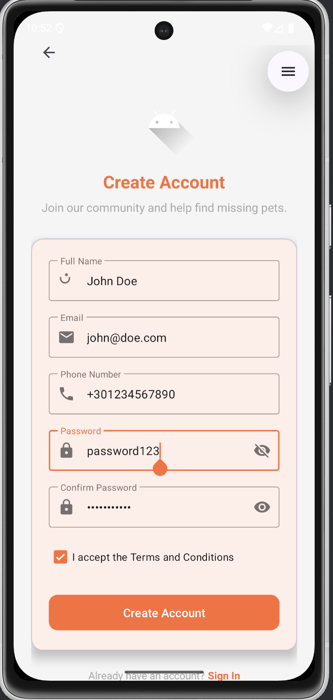
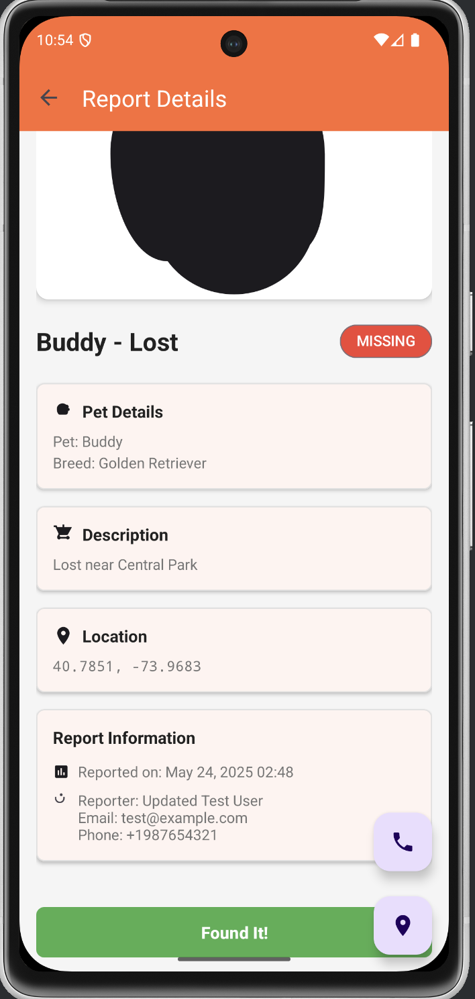

# Missing Pets - Android App

A comprehensive Android application for reporting and finding missing pets. This app helps pet owners report lost pets and helps community members report found pets, with location-based search and real-time updates.

## 📱 Screenshots

### Authentication
<div align="center">
  
  
</div>

### Main Interface
<div align="center">
  
  
</div>

### Reports & Location
<div align="center">
  
  
  
</div>

## 🚀 Features

### Core Functionality
- **User Authentication**: Secure registration and login system
- **Report Missing Pets**: Create detailed reports with photos and location
- **Search Found Pets**: Browse and filter reports of found pets
- **Location-Based Search**: Find pets within specific radius using GPS
- **Interactive Maps**: View pet locations on Google Maps
- **Photo Management**: Upload and view multiple photos per report
- **Real-time Updates**: Stay updated with latest reports

### Advanced Features
- **Geospatial Search**: Search pets by location radius
- **Smart Filtering**: Filter by status (lost/found), date, location
- **Report Management**: Edit and update your reports
- **Offline Support**: Basic functionality works offline
- **Secure Storage**: Encrypted local data storage
- **Push Notifications**: Get notified about relevant reports

## 🛠️ Tech Stack

- **Platform**: Android (API 24+)
- **Language**: Java
- **Architecture**: MVVM with Repository Pattern
- **UI Framework**: Material Design Components
- **Networking**: Retrofit 2 + OkHttp
- **Maps**: Google Maps SDK
- **Image Loading**: Custom implementation
- **Local Storage**: SharedPreferences + Security Crypto
- **Navigation**: Android Navigation Component

## 📋 Requirements

- **Android Version**: 7.0 (API level 24) or higher
- **Permissions**:
  - Internet access for API communication
  - Location access for geospatial features
  - Storage access for photo uploads
- **Google Play Services**: Required for Maps functionality
- **Network**: Internet connection required for full functionality

## 🔧 Installation

### Prerequisites
- Android Studio Arctic Fox or later
- Java 11 or higher
- Android SDK with API 24+
- Google Maps API key

### Setup Steps

1. **Clone the repository**
   ```bash
   git clone <repository-url>
   cd missingpets
   ```

2. **Open in Android Studio**
   - Launch Android Studio
   - Select "Open an existing project"
   - Navigate to the cloned directory

3. **Configure Google Maps API**
   - Get a Google Maps API key from [Google Cloud Console](https://console.cloud.google.com/)
   - Update the API key in `AndroidManifest.xml`:
   ```xml
   <meta-data
       android:name="com.google.android.geo.API_KEY"
       android:value="YOUR_API_KEY_HERE" />
   ```

4. **Configure Backend URL**
   - Update the base URL in `ApiClient.java` to point to your backend server
   ```java
   private static final String BASE_URL = "http://your-server-url:3000/api/";
   ```

5. **Build and Run**
   - Sync the project with Gradle files
   - Run the app on an emulator or physical device

## 📚 App Architecture

### Main Components

- **Authentication Flow**: Login/Register screens with JWT token management
- **Main Dashboard**: Central hub with quick access to all features
- **Pet Management**: Create and manage pet profiles
- **Report System**: Create, view, and manage missing/found pet reports
- **Map Integration**: Interactive map view with location-based search
- **Search & Filter**: Advanced filtering options for finding specific reports

### Key Activities

- `SplashActivity`: App initialization and auth check
- `LoginActivity`: User authentication
- `RegisterActivity`: New user registration
- `MainActivity`: Main dashboard with feature cards
- `ReportPetActivity`: Create new missing pet reports
- `MissingPetsActivity`: Browse and search reports
- `MapViewActivity`: Map-based report viewing
- `EnhancedReportDetailActivity`: Detailed report view

### Data Models

- **User**: User profile and authentication data
- **Pet**: Pet information (name, breed, photos, physical characteristics)
- **Report**: Missing/found pet reports with location and status
- **Location**: GeoJSON point data for location tracking

## 🎨 UI/UX Features

### Design System
- **Material Design**: Modern, consistent UI components
- **Responsive Layout**: Adapts to different screen sizes
- **Dark/Light Theme**: Follows system theme preferences
- **Accessibility**: Screen reader support and proper contrast ratios

### User Experience
- **Intuitive Navigation**: Clear navigation flow between screens
- **Search & Filter**: Easy-to-use search with multiple filter options
- **Visual Feedback**: Loading states, success/error messages
- **Offline Indicators**: Clear indication when features require internet

## 🔒 Security Features

- **JWT Authentication**: Secure token-based authentication
- **Encrypted Storage**: Sensitive data encrypted locally
- **Network Security**: HTTPS communication with certificate pinning
- **Input Validation**: Client-side validation for all user inputs
- **Permission Management**: Proper handling of runtime permissions

## 📊 API Integration

The app integrates with the Missing Pets Backend API for:

- User authentication and profile management
- CRUD operations for pets and reports
- Geospatial search queries
- File uploads for pet photos
- Real-time updates via WebSocket connections

### API Endpoints Used
- `POST /auth/login` - User authentication
- `POST /auth/signup` - User registration
- `GET /reports` - Fetch reports with filtering
- `POST /reports` - Create new reports
- `GET /pets` - Fetch user's pets
- `POST /pets` - Create new pet profiles

## 🧪 Testing

### Manual Testing
- Test all authentication flows
- Verify report creation and search
- Test location-based features
- Validate offline functionality
- Check permission handling

### Unit Testing
- Model validation
- API response parsing
- Utility functions
- Preference management

## 📱 User Guide

### Getting Started
1. **Register**: Create a new account with email and password
2. **Login**: Sign in with your credentials
3. **Grant Permissions**: Allow location and storage access when prompted

### Reporting a Missing Pet
1. Tap "Report Missing Pet" from the main menu
2. Fill in pet details (name, breed, description)
3. Add photos of your pet
4. Set the last known location on the map
5. Submit the report

### Searching for Found Pets
1. Tap "Search Found Pets" from the main menu
2. Use filters to narrow down results (location, date, breed)
3. Tap on reports to view detailed information
4. Contact the reporter if you recognize a pet

### Using Map View
1. Tap "View Map" to see all reports on an interactive map
2. Use location search to find pets near specific areas
3. Adjust search radius using the slider
4. Tap map markers to view report details

## 🔧 Configuration

### App Settings
- **Server URL**: Configure backend server endpoint
- **Location Settings**: Adjust location accuracy and update intervals
- **Notification Settings**: Configure push notification preferences
- **Theme Settings**: Choose between light/dark themes

### Development Settings
- **Debug Mode**: Enable additional logging for development
- **Mock Data**: Use sample data for testing without backend
- **API Timeout**: Configure network request timeouts

## 🚀 Deployment

### Release Build
1. **Generate Signed APK**:
   - Build → Generate Signed Bundle/APK
   - Choose APK and create/use existing keystore
   - Select release build variant

2. **ProGuard Configuration**:
   - Code obfuscation enabled for release builds
   - API models and networking classes preserved

3. **Testing Checklist**:
   - Test on multiple device sizes and Android versions
   - Verify all permissions work correctly
   - Test offline functionality
   - Validate Google Maps integration

### Play Store Release
- Follow Google Play Console guidelines
- Provide app descriptions and screenshots
- Set up app signing and security settings
- Configure content rating and target audience

## 🤝 Contributing

1. Fork the repository
2. Create a feature branch (`git checkout -b feature/amazing-feature`)
3. Commit your changes (`git commit -m 'Add amazing feature'`)
4. Push to the branch (`git push origin feature/amazing-feature`)
5. Open a Pull Request

### Code Style
- Follow Android coding conventions
- Use meaningful variable and method names
- Add comments for complex logic
- Maintain consistent indentation

## 📄 License

This project is licensed under the MIT License - see the LICENSE file for details.

## 🆘 Support & Troubleshooting

### Common Issues

**Login/Registration Issues**:
- Verify internet connection
- Check if backend server is running
- Ensure email format is valid

**Location Features Not Working**:
- Grant location permissions in device settings
- Enable GPS/Location services
- Check Google Play Services is updated

**Map Not Loading**:
- Verify Google Maps API key is valid
- Check API key has Maps SDK enabled
- Ensure device has Google Play Services

**Photo Upload Issues**:
- Grant storage permissions
- Check available device storage
- Verify image size is within limits

### Getting Help
- Check the logs in Android Studio for detailed error messages
- Review the API documentation for backend integration
- Contact support with device model, Android version, and error description

## 🔄 Updates & Roadmap

### Recent Updates
- Enhanced search and filtering capabilities
- Improved map performance and user experience
- Added offline support for basic functionality
- Updated Material Design components

### Planned Features
- Push notifications for nearby reports
- In-app messaging between users
- Advanced photo recognition features
- Social sharing capabilities
- Multi-language support

## 📞 Contact

For questions, suggestions, or support, please contact:
- **Email**: support@missingpets.app
- **GitHub Issues**: Create an issue in this repository
- **Documentation**: Check the wiki for detailed guides

---

**Missing Pets Android App** - Reuniting families, one pet at a time 🐾
